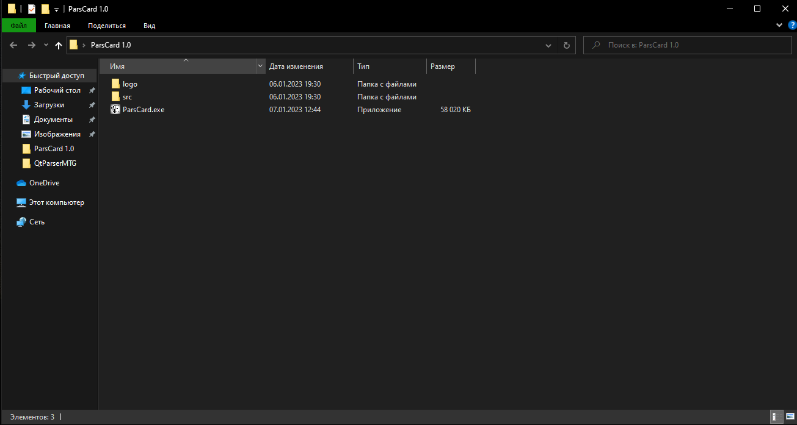
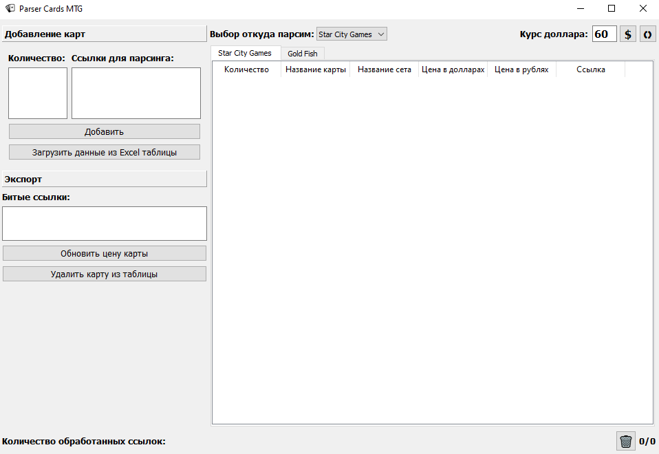
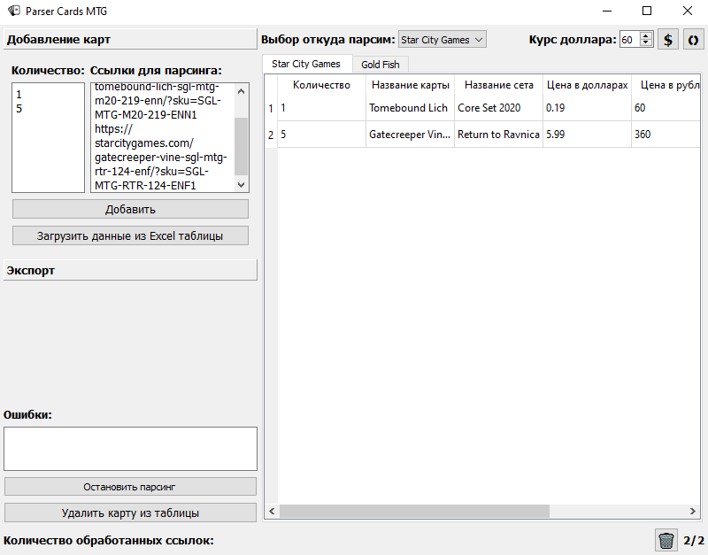

# QtParserMTG 1.2

## О проекте

### Описание

Приложение предназначено для хранение информации о картах (количество, название карты, название сете, цена в долларах, цена в рублях, ссылка).
Цель приложения сбор информации для продажи карт, мониторинга цен, создание выходной Excel таблицы.

### Технологии

- Python 3.10.9
- PyQt5
- SQLite
- BeautifulSoup
- Pandas
- pytest

## Запуск приложения

Запустите exe файл приложения находящийся в папке ParsCard.

Главное окно после запуска программы.

После добавление количества карт и ссылок в Text Edit их можно будет добавить в таблицу.

### Описание кнопок
- $  - Перерасчёт цены в рублях;
- 🗘 - Обновление цен карт;
- 🗑  - Удаление всех карт из таблиц;

## Будущие изменения

- [x] Добавление multiprocessing, для ускорения парсинга;
- [x] Сделать сборку приложения под Linux;
- [x] Добавить поис по названию и фильтры;
- [x] Переделать взаимодействие с БД;
- [ ] Сделать сборку приложения под Win7;
- [ ] Собранный инсталлятора с помощью NSIS;
- [ ] Обновление цены одной карты;
- [ ] Написать свои исключения (для обработки ошибок парсинга).

## Ссылки для скачивания образа:
- Win10: https://drive.google.com/drive/folders/1uhbKDeVflzhq1C1IXs3DfskdX0zLIN8I?usp=sharing;
- linux: https://drive.google.com/drive/folders/1-U582XKN_1L-_ozhqEDlCGYh426gJqbB?usp=sharing.
